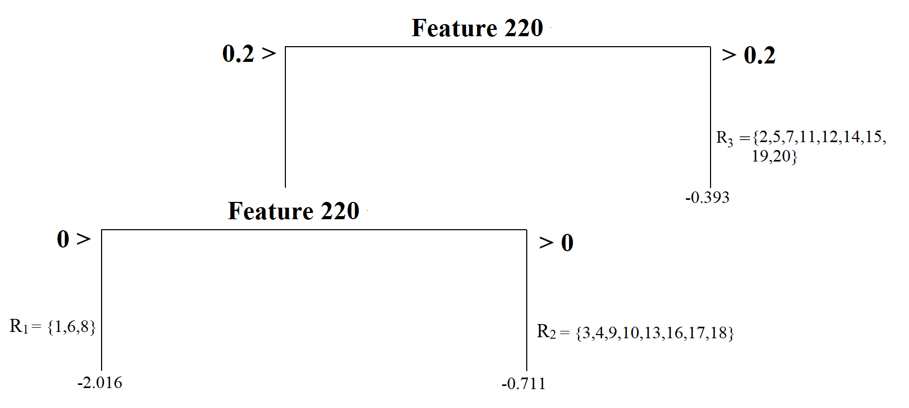
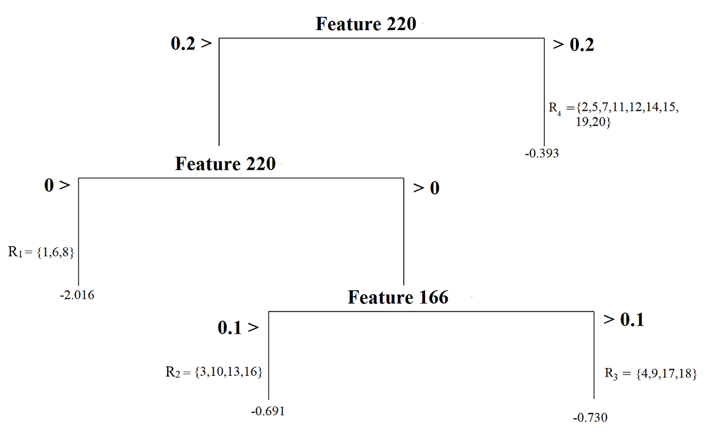

<style>

.blockquote {
  border-left: 5px solid #007935;
  background: #f9f9f9;
  padding: 10px;
  padding-left: 30px;
  margin-left: 16px;
  margin-right: 0;
  border-radius: 0px 4px 4px 0px;
}

#infobox {
  padding: 1em 1em 1em 4em;
  margin-bottom: 10px;
  border: 2px solid black;
  border-radius: 10px;
  background: #E6F6DC 5px center/3em no-repeat;
}

.centering[
  float: center;
]

.left-column2 {
  width: 50%;
  height: 92%;
  float: left;
  padding-top: 1em;
}

.right-column2 {
  width: 50%;
  float: right;
  padding-top: 1em;
}

.remark-code {
  font-size: 18px;
}

.tiny .remark-code { /*Change made here*/
  font-size: 75% !important;
}

.tiny2 .remark-code { /*Change made here*/
  font-size: 60% !important;
}

.indent {
  margin-left: 3em;
}

.single {
  line-height: 1 ;
}


.double {
  line-height: 2 ;
}

.title-slide h1 {
  padding-top: 0px;
  font-size: 40px;
  text-align: center;
  padding-bottom: 18px;
  margin-bottom: 18px;
}

.title-slide h2 {
  font-size: 30px;
  text-align: center;
  padding-top: 0px;
  margin-top: 0px;
}

.title-slide h3 {
  font-size: 30px;
  color: #26272A;
  text-align: center;
  text-shadow: none;
  padding: 10px;
  margin: 10px;
  line-height: 1.2;
}

</style>

```{R, setup, include = F}
library(pacman)
p_load(here, tidyverse, ggplot2, xaringan, knitr, kableExtra, 
       xaringanthemer,DT,dplyr,gridExtra, plotly)

#i_am("B:/UO Teaching/EDUC614/Winter22/Slide Template/template.rmd")

red_pink <- "#e64173"
turquoise = "#20B2AA"
orange = "#FFA500"
red = "#fb6107"
blue = "#3b3b9a"
green = "#8bb174"
grey_light = "grey70"
grey_mid = "grey50"
grey_dark = "grey20"
purple = "#6A5ACD"
slate = "#314f4f"

extra_css <- list(
  ".red"   = list(color = "red"),
  ".blue"  =list(color = "blue"),
  ".red-pink" = list(color= "red_pink"),
  ".grey-light" = list(color= "grey_light"),
  ".purple" = list(color = "purple"),
  ".small" = list("font-size" = "90%"))

write_extra_css(css = extra_css, outfile = "my_custom.css")

# Knitr options
opts_chunk$set(
  comment = "",
  fig.align = "center",
  fig.height = 4,
  fig.width = 4,
  warning = F,
  message = F
)
opts_chunk$set(dev = "svg")
options(device = function(file, width, height) {
  svg(tempfile(), width = width, height = height)
})

options(knitr.table.format = "html")

options(scipen = 99, digits = 4,max.print = 100,width = 120)

require(here)
```

### The goals:

Decision Trees

- The basics of a decision tree
    
  - Tree structure
    
  - Predictions from a decision tree
    
  - Loss function
    
  - Growing a decision tree model
    
  - Pruning a decision tree model
    
- The `rpart()` function
    
- Review of Kaggle notebooks for building Decision Tree models
  
---

# Decision Trees

- In this lecture, we will again consider the toy readability dataset (N=20) 
- We used to predict a readability score from two predictors: Feature 220 and Feature 166 

.indent[
.single[
.tiny2[
```{r, echo=TRUE,eval=TRUE}
readability_sub <- read.csv(here('data/readability_sub.csv'),
                            header=TRUE)

readability_sub[,c('V220','V166','target')]
```
]]]

---

# Basics of a decision tree

### Tree Structure

Let's imagine a simple tree model to predict readability scores from Feature 220.


This model splits the sample into two pieces using a **split point** of 0.2 for the predictor variable (Feature 220). 

There are 11 observations with Feature 220 less than 0.2 and nine with Feature 220 larger than 0.2. The top of the tree model is called **root node**, and the $R_1$ and $R_2$ in this model are called **terminal nodes**.
---


- This model has two terminal nodes. 

- There is a number assigned to each terminal node. These numbers are the average values for the target outcome (readability score) for those observations in that specific node. It can be symbolically shown as

$$\bar{Y_t} = \frac{1}{n_t}\sum_{i\epsilon R_t} Y_i,$$

.indent[
where $n_t$ is the number of observations in a terminal node, and $R_t$ represents the set of observations in the $t_{th}$ node.
]

---


- There is also a concept of **depth** of a tree. 

- The root node is counted as depth 0, and each split increases the depth of the tree by one. In this case, we can say that this tree model has a depth of one.

---

We can increase the complexity of our tree model by splitting the first node into two more nodes using a split point of 0. 



Now, our model has a **depth of two** and a total of **three terminal nodes**. 

Each terminal node is assigned a score by computing the average outcome for those observations in that node. 

---

The tree model can have nodes from splitting another variable. 

For instance, the model below first splits the observations based on Feature 220, then based on Feature 166, yielding a tree model again with **three nodes** with a **depth of two**. 

This tree model's complexity is the same as the previous one's; the only difference is that we have nodes from two predictors instead of one.

<br>


---

A final example is another tree model with increasing complexity and having a depth of three and four nodes. 

It first splits observations based on whether or not Feature 220 is less than 0.2, then splits observations based on whether or not Feature 220 is less than 0, and finally splits observations based on whether or not Feature 166 is less than 0.1.


---

### Predictions

Suppose you developed a tree model and decided to use this model to make predictions for new observations. 

Let's assume our model is the below. 


---

How do we use this model to make predictions for new observations?

Suppose that there is a new reading passage:

  - The value for Feature 220 is - 0.5
  
  - The value for Feature 166 is 0. 

What is the predicted readability score for this passage based on this tree model?

You can trace a path starting from the **root node** (top of the tree) and see where this reading passage will end. 

<center> 

---

Suppose you have another new reading passage: 

  - The value for Feature 220 is 0.1
  
  - The value for Feature 166 is 0. 
  
What is the predicted readability score for this passage based on this tree model?

<center> 

---

### Loss function

When we fit a tree model, the algorithm decides the best split that minimizes the sum of squared errors. The sum of squared error from a tree model can be shown as 

$$SSE = \sum_{t=1}^{T} \sum_{i \epsilon R_t} (Y_i - \hat{Y}_{R_{t}})^2$$

where $T$ is the total number of terminal nodes in the tree model, and $\hat{Y}_{R_{t}}$ is the prediction for the observations in the $t^{th}$ node (average target outcome for those observations in the $t^{th}$ node).

---

### Growing a tree

Deciding on a root node and then growing a tree model from that root node can become computationally exhaustive depending on the size of the dataset and the number of variables. 

The decision tree algorithm 

  - searches all variables designated as predictors in the dataset at all possible split points for these variables, 
  
  - calculates the SSE for all possible splits, 
  
  - and then finds the split that would reduce the prediction error the most. 
  
The search continues by growing the tree model sequentially until there is no more split left that would give better predictions.

---

Let's demonstrate the logic of this search process with the toy dataset (N=20) and two predictor variables: Feature 220 and Feature 166. 

Before we start our search process, we should come up with a baseline SSE to decide whether any future split will improve our predictions. 

We can imagine that a model with no split and using the mean of all 20 observations to predict the target outcome is the simplest baseline model. 

SSE from this baseline model is equal to 17.73

.single[
.tiny[
```{r, echo=TRUE,eval=TRUE}

# average outcome

mu <- mean(readability_sub$target)

# SSE for baseline model

sum((readability_sub$target - mu)^2)

```
]]

---

#### **Find the root node**

The first step in building the tree model is to find the root node. 

In this case, we have two candidates for the root node: Feature 220 and Feature 166. 

We want to know which predictor should be the root node and what value we should use to split to improve the baseline SSE the most. 

The following is what the process would look like:

1. Pick a split point

2. Divide 20 observations into two nodes based on the split point

3. Calculate the average target outcome within each node as predictions for the observations in that node

4. Calculate SSE within each node using the predictions from Step 3, and sum them all across two nodes. 

5. Repeat Steps 1 - 4 for every possible split point, and find the best split point with the minimum SSE

6. Repeat Steps 1 - 5 for every possible predictor.

---

The search process indicates that the best split point for Feature 220 is -0.026. 

If we divide the observations into two nodes based on Feature 220 using the split point -0.026, SSE would be equal to 12.20, a significant improvement over the baseline model.

<br>

```{r, echo=FALSE,eval=TRUE,fig.width=6,fig.height=4}

splits1 <- seq(-0.24,0.56,0.001)

# For every split point, partition the observations into two groups and then
# make predictions based on the partitioning. Save the SSE in an empy object

sse1 <- c()

for(i in 1:length(splits1)){
  
  gr1 <- which(readability_sub$V220 <= splits1[i])
  gr2 <- which(readability_sub$V220 > splits1[i])
  
  pr1 <- mean(readability_sub[gr1,]$target)
  pr2 <- mean(readability_sub[gr2,]$target)
  
  sse1[i] = sum((readability_sub[gr1,]$target - pr1)^2) + 
            sum((readability_sub[gr2,]$target - pr2)^2)
}

ggplot()+
  geom_line(aes(x=splits1,y=sse1))+
  xlab('Split Points (Feature 220)')+
  ylab('Sum of Squared Residuals')+
  theme_bw()+
  geom_vline(xintercept = -0.026,lty=2)+
  annotate('text',x=-0.0,y=16,label='-0.026')
```

---

We can (Steps 1-4) repeat the same process for Feature 166. 

The search process indicates that the best split point for Feature 166 is 0.19. 

If we divide the observations into two nodes based on Feature 166 using the split point 0.19, SSE would be equal to 16.62, also an improvement over the baseline model.

```{r, echo=FALSE,eval=TRUE,fig.width=6,fig.height=4}

splits2 <- seq(-0.02,0.22,.001)

# For every split point, partition the observations into two groups and then
# make predictions based on the partitioning. Save the SSE in an empyy object

sse2 <- c()

for(i in 1:length(splits2)){
  
  gr1 <- which(readability_sub$V166 <= splits2[i])
  gr2 <- which(readability_sub$V166 > splits2[i])
  
  pr1 <- mean(readability_sub[gr1,]$target)
  pr2 <- mean(readability_sub[gr2,]$target)
  
  sse2[i] = sum((readability_sub[gr1,]$target - pr1)^2) + 
            sum((readability_sub[gr2,]$target - pr2)^2)
}

ggplot()+
  geom_line(aes(x=splits2,y=sse2))+
  xlab('Split Points (Feature 166)')+
  ylab('Sum of Squared Residuals')+
  theme_bw()+
  geom_vline(xintercept = 0.189,lty=2)+
  annotate('text',x=0.195,y=18,label='0.189')
```

---

We have two choices for the **root node** (because we have two predictors in this demonstration):

- Feature 220, Best split point = -0.026, SSE = 12.20

- Feature 166, Best split point = 0.189, SSE = 16.62

Both options improve our predictions over the baseline (SSE = 17.73), but one is better. Therefore, our final decision to start growing our tree is to pick Feature 220 as our **root node** and split it at -0.07. 

**Our tree model starts growing!**

<center> 

---

Now, we have to decide if we should add another split to either one of these two nodes. There are now four possible split scenarios. 

1. For the first terminal node on the left, we can split the observations based on Feature 220.

2. For the first terminal node on the left, we can split the observations based on Feature 166.

3. For the second terminal node on the right, we can split the observations based on Feature 220.

4. For the second terminal node on the right, we can split the observations based on Feature 166.

For each of these scenarios, we can implement Step 1 - Step 4, identifying the best split point and what SSE that split yields. The code below implements these steps for all four scenarios.

---

**Scenario 1: Split the first terminal node based on Feature 220**

```{r, echo=FALSE,eval=TRUE,fig.width=6,fig.height=4}

node1 <- c(1,6,8)
node2 <- c(2,3,4,5,7,9,10,11,12,13,14,15,16,17,18,19,20)

# Splits based on Feature220 on node 1

splits1 <- seq(-0.24,0.56,0.001)

sse1 <- c()

for(i in 1:length(splits1)){
  
  gr1 <- which(readability_sub[node1,]$V220 <= splits1[i])
  gr2 <- which(readability_sub[node1,]$V220 > splits1[i])
  gr3 <- node2
  
  pr1 <- mean(readability_sub[node1[gr1],]$target)
  pr2 <- mean(readability_sub[node1[gr2],]$target)
  pr3 <- mean(readability_sub[node2,]$target)

    
  sse1[i] = sum((readability_sub[node1[gr1],]$target - pr1)^2) + 
            sum((readability_sub[node1[gr2],]$target - pr2)^2) +
            sum((readability_sub[node2,]$target - pr3)^2) 
}

ggplot()+
  geom_line(aes(x=splits1,y=sse1))+
  xlab('Split Points (Feature 220) on Node 1')+
  ylab('Sum of Squared Residuals')+
  theme_bw()+
  geom_vline(xintercept = -0.19,lty=2)+
  annotate('text',x=-0.23,y=12,label='-0.19')

```

---

**Scenario 2: Split the first terminal node based on Feature 166**

```{r, echo=FALSE,eval=TRUE,fig.width=6,fig.height=4}

# Splits based on Feature 166 for node 1

splits2 <- seq(-0.02,0.22,.001)

sse2 <- c()

for(i in 1:length(splits2)){
  
  gr1 <- which(readability_sub[node1,]$V166 <= splits2[i])
  gr2 <- which(readability_sub[node1,]$V166 > splits2[i])
  gr3 <- node2
  
  pr1 <- mean(readability_sub[node1[gr1],]$target)
  pr2 <- mean(readability_sub[node1[gr2],]$target)
  pr3 <- mean(readability_sub[node2,]$target)

    
  sse2[i] = sum((readability_sub[node1[gr1],]$target - pr1)^2) + 
            sum((readability_sub[node1[gr2],]$target - pr2)^2) +
            sum((readability_sub[node2,]$target - pr3)^2) 
}

ggplot()+
  geom_line(aes(x=splits2,y=sse2))+
  xlab('Split Points (Feature 166) on Node 1')+
  ylab('Sum of Squared Residuals')+
  theme_bw()+
  geom_vline(xintercept = 0.066,lty=2)+
  annotate('text',x=0.06,y=12,label='0.066')
```

---

**Scenario 3: Split the second terminal node based on Feature 220**

```{r, echo=FALSE,eval=TRUE,fig.width=6,fig.height=4}

# Splits based on Feature 220 for node 2

splits3 <- seq(-0.24,0.56,0.001)

sse3 <- c()

for(i in 1:length(splits3)){
  
  gr1 <- which(readability_sub[node2,]$V220 <= splits3[i])
  gr2 <- which(readability_sub[node2,]$V220 > splits3[i])
  gr3 <- node1
  
  pr1 <- mean(readability_sub[node2[gr1],]$target)
  pr2 <- mean(readability_sub[node2[gr2],]$target)
  pr3 <- mean(readability_sub[node1,]$target)

    
  sse3[i] = sum((readability_sub[node2[gr1],]$target - pr1)^2) + 
            sum((readability_sub[node2[gr2],]$target - pr2)^2) +
            sum((readability_sub[node1,]$target - pr3)^2) 
}


ggplot()+
  geom_line(aes(x=splits3,y=sse3))+
  xlab('Split Points (Feature 220) on Node 2')+
  ylab('Sum of Squared Residuals')+
  theme_bw()+
  geom_vline(xintercept = 0.178,lty=2)+
  annotate('text',x=0.16,y=12,label='0.178')
```

---

**Scenario 4: Split the second terminal node based on Feature 166**

```{r, echo=FALSE,eval=TRUE,fig.width=6,fig.height=4}

# Splits based on Feature 166 for node 2

splits4 <-  seq(-0.02,0.22,.001)

sse4 <- c()

for(i in 1:length(splits4)){
  
  gr1 <- which(readability_sub[node2,]$V166 <= splits4[i])
  gr2 <- which(readability_sub[node2,]$V166 > splits4[i])
  gr3 <- node1
  
  pr1 <- mean(readability_sub[node2[gr1],]$target)
  pr2 <- mean(readability_sub[node2[gr2],]$target)
  pr3 <- mean(readability_sub[node1,]$target)

    
  sse4[i] = sum((readability_sub[node2[gr1],]$target - pr1)^2) + 
            sum((readability_sub[node2[gr2],]$target - pr2)^2) +
            sum((readability_sub[node1,]$target - pr3)^2) 
}

ggplot()+
  geom_line(aes(x=splits4,y=sse4))+
  xlab('Split Points (Feature 166) on Node 2')+
  ylab('Sum of Squared Residuals')+
  theme_bw()+
  geom_vline(xintercept = 0.067,lty=2)+
  annotate('text',x=0.06,y=12,label='0.067')
```

---

Based on our search, the following splits provided the least SSEs:

1. 1st terminal node, Split variable: Feature220, Split Point: -0.19, SSE = 8.01

2. 1st terminal node, Split variable: Feature166, Split Point: 0.066, SSE = 8.01

3. 2nd terminal node, Split variable: Feature220, Split Point: 0.178, SSE = 10.94

4. 2nd terminal node, Split variable: Feature166, Split Point: 0.067, SSE = 9.96

We can decide to continue with either Scenario 1 or 2 because they yield the minimum SSE. Assuming we decide Scenario 1, our tree model now looks like this.

<center> 

---


#### **Termination of Growth**

The search process continues until a specific criterion is met to stop the algorithm. 

There may be several conditions where we may constrain the growth and force the algorithm to stop searching for additional growth in the tree model. 

Some of these are listed below:

- **Minimizing SSE**: the algorithm stops when there is no potential split in any of the existing nodes that would reduce the sum of squared errors.

- ***The minimum number of observations to split**: the algorithm does not attempt to split a node unless there is a certain number of observations in the node. 

- **Maximum depth**: The algorithm stops searching when the tree reaches a certain depth.

---

### Pruning a tree

- Overfitting and underfitting also occur as one develops a tree model. 

- When the depth of a tree becomes unnecessarily large, there is a risk of overfitting (increased variance in model predictions across samples, less generalizable). 

- When the depth of a tree is small, there is a risk of underfitting (increased bias in model predictions, underperforming model).

- To balance the model variance and model bias,  we can add a penalty term to the loss function:

$$SSE = \sum_{t=1}^{T} \sum_{i \epsilon R_t} (Y_i - \hat{Y}_{R_{t}})^2 + \alpha T$$

- The penalty term $\alpha$ is known as the **cost complexity** parameter. 

- The product term $\alpha T$ increases as the number of terminal nodes increases in the model, so this term penalizes the increasing complexity of the tree model. 

- By fine-tuning the value of $\alpha$ through cross-validation, we can find a balance between model variance and bias, as we did for regression models. 

- The process is called pruning because the terminal nodes from the tree are eliminated in a nested way for increasing levels of $\alpha$.

---
<br>
<br>
<br>
<br>
<br>
<br>
<br>
<br>
<br>

<center>

## Growing trees with the `rpart()` function
---

Let's first replicate our manual search in previous slides to build a tree model predicting the readability scores from Feature 220 and Feature 166 in the toy dataset.

.single[
.tiny2[
```{r, echo=TRUE,eval=FALSE}

require(rpart)
require(rattle)


dt <- rpart(formula = target ~ V220 + V166,
            data    = readability_sub,
            method  = "anova",
            control = list(minsplit  = 1,
                           cp        = 0,
                           minbucket = 1,
                           maxdepth  = 2)
            )

```
]]

- The `formula` argument works similarly as in the regression models.

- The `data` argument provides the name of the datasetat the outcome is a continuous variable and this is a regression problem.

- The `control` argument is a list object with several settings to be used during tree-building. 

  - `minsplit=1` forces algorithm not to attempt to split a node unless there is at least one observation. 

  - `minbucket=1` forces algorithm to have at least one observation for any node. 

  - `maxdepth = 2` forces algorithm to stop when the depth of a tree reaches to 2.

  - `cp=0` indicates that we do not want to apply any penalty term ( $\lambda = 0$ ) during the model building process.

---

.single[
.tiny2[
```{r, echo=FALSE,eval=TRUE}

require(rpart)
require(rattle)


dt <- rpart(formula = target ~ V220 + V166,
            data    = readability_sub,
            method  = "anova",
            control = list(minsplit  = 1,
                           cp        = 0,
                           minbucket = 1,
                           maxdepth  = 2)
            )

```
]]

.single[
.tiny2[
```{r, echo=TRUE,eval=TRUE,fig.width=5,fig.height=5}
  # ?prp
  # check for a lot of settings for modifying this plot

fancyRpartPlot(dt,type=2,sub='')

```
]]

---

You can also ask for more specific information about the model-building process by running the `summary()` function.

.single[
.tiny2[
```{r, echo=TRUE,eval=TRUE,}
summary(dt)
```
]]

---

###  Tree pruning by increasing the complexity parameter

- We will now expand the model by adding more predictors to be considered for the tree model. 

- Suppose that we now have six different predictors to be considered for the tree model. 

- We will provide the same settings with six predictors except for the complexity parameter. 

- We will fit three models by setting the complexity parameter at 0, 0.05, and 0.1 to see what happens to the tree model as we increase the complexity parameter.

---

.single[
.tiny2[

```{r, echo=TRUE,eval=TRUE,fig.width=6,fig.height=6}

dt <- rpart(formula = target ~ V78 + V166 + V220 + V375 + V562 + V568,
            data    = readability_sub,
            method  = "anova",
            control = list(minsplit=1,
                           cp=0,
                           minbucket = 1,
                           maxdepth = 5)
            )


fancyRpartPlot(dt,type=2,sub='')

```
]]
---

.single[
.tiny2[
```{r, echo=TRUE,eval=TRUE,fig.width=6,fig.height=6}


dt <- rpart(formula = target ~ V78 + V166 + V220 + V375 + V562 + V568,
            data    = readability_sub,
            method  = "anova",
            control = list(minsplit=1,
                           cp=0.05,
                           minbucket = 1,
                           maxdepth = 5)
            )


fancyRpartPlot(dt,type=2,sub='')

```
]]

---

.single[
.tiny2[

```{r, echo=TRUE,eval=TRUE,fig.width=6,fig.height=6}


dt <- rpart(formula = target ~ V78 + V166 + V220 + V375 + V562 + V568,
            data    = readability_sub,
            method  = "anova",
            control = list(minsplit=1,
                           cp=0.1,
                           minbucket = 1,
                           maxdepth = 5)
            )


fancyRpartPlot(dt,type=2,sub='')

```

]]

---

#### **Kaggle Notebook**

- [Building a Prediction Model using a Decision Tree](https://www.kaggle.com/code/uocoeeds/building-a-prediction-model-using-a-decision-tree)

** Performance Comparison of Different Algorithms**

|                   | R-square | MAE   | RMSE
|-------------------|:--------:|:-----:|:-----:|
| Linear Regression |  0.658   | 0.499 | 0.620 |
| Ridge Regression  |  0.727   | 0.432 | 0.536 |
| Lasso Regression  |  0.721   | 0.433 | 0.542 |
| Elastic Net       |  0.726   | 0.433 | 0.539 |
| KNN               |  0.611   | 0.519 | 0.648 |
| Decision Tree     |  0.499   | 0.574 | 0.724 |

---

#### **Kaggle Notebook**

- [Building a Classification Model using a Decision Tree](https://www.kaggle.com/code/uocoeeds/building-a-classification-tree-algorithm)

** Performance Comparison of Different Algorithms**

|                                         | -LL | AUC | ACC | TPR | TNR | FPR |PRE  |
|-----------------------------------------|:---:|:---:|:---:|:---:|:---:|:---:|:---:|
| Logistic Regression                     |0.510|0.719|0.755|0.142|0.949|0.051|0.471|
| Logistic Regression with Ridge Penalty  |0.511|0.718|0.754|0.123|0.954|0.046|0.461|
| Logistic Regression with Lasso Penalty  |0.509|0.720|0.754|0.127|0.952|0.048|0.458|
| Logistic Regression with Elastic Net    |0.509|0.720|0.753|0.127|0.952|0.048|0.456|
| KNN                                     |  ?  |    ?|   ? | ?   |  ?  |  ?  |  ?  |
| Decision Tree                           |0.558|0.603|0.757|0.031|0.986|0.014|0.423|

