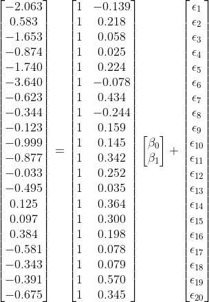

<style>
.list-group-item.active, .list-group-item.active:focus, .list-group-item.active:hover {
    z-index: 2;
    color: #fff;
    background-color: #FC4445;
    border-color: #97CAEF;
}

#infobox {
  padding: 1em 1em 1em 4em;
  margin-bottom: 10px;
  border: 2px solid black;
  border-radius: 10px;
  background: #E6F6DC 5px center/3em no-repeat;
}


</style>


```{r setup, include=FALSE}
knitr::opts_chunk$set(comment = "",fig.align='center')
require(here)
require(ggplot2)
require(plot3D)
require(kableExtra)
require(knitr)
require(gifski)
require(magick)
require(gridExtra)
library(scales)
library(lubridate)
require(plotly)

options(scipen=99)

```

`r paste('[Updated:',format(Sys.time(),'%a, %b %d, %Y - %H:%M:%S'),']')`


The prediction algorithms are classified into two main categories in the machine learning literature: *supervised* and *unsupervised*. Supervised algorithms are used when the dataset has an actual outcome of interest to predict (labels), and the goal is to build the "best" model predicting the outcome of interest. On the other side, unsupervised algorithms are used when the dataset doesn't have an outcome of interest. The goal is typically to identify similar groups of observations (rows of data) or similar groups of variables (columns of data) in data. In this course, we plan to cover several *supervised* algorithms. Linear regression is one of the most straightforward approaches among supervised algorithms and the easiest to interpret.

# Model Description

In most general terms, the linear regression model with $P$ predictors ($X_1$,$X_2$,$X_3$,...,$X_p$) to predict an outcome ($Y$) can be written as the following:

$$ Y = \beta_0  + \sum_{p=1}^{P} \beta_pX_{p} + \epsilon.$$
In this model, $Y$ represents the observed value for the outcome of an observation, $X_{p}$ represents the observed value of the $p^{th}$ variable for the same observation, and $\beta_p$ is the associated model parameter for the $p^{th}$ variable. $\epsilon$ is the model error (residual) for the observation.

This model includes only the main effects of each predictor and can be easily extended by including quadratic or higher-order polynomial terms for all (or a specific subset of) predictors. For instance, the model below includes all first-order, second-order, and third-order polynomial terms for all predictors. 

$$ Y = \beta_0  + \sum_{p=1}^{P} \beta_pX_{p} + \sum_{k=1}^{P} \beta_{k+P}X_{k}^2 + \sum_{m=1}^{P} \beta_{m+2P}X_{m}^3 + \epsilon.$$
Sometimes, the effect of predictor variables on the outcome variable is not additive, and the effect of one predictor on the response variable can depend on the levels of another predictor. These non-additive effects are also called interaction effects. The interaction effects can also be a first-order interaction (interaction between two variables, e.g., $X_1*X_2$), second-order interaction ($X_1*X_2*X_3$), or higher orders.  It is also possible to add the interaction effects to the model. For instance, the model below also adds the first-order interactions.

$$ Y = \beta_0  + \sum_{p=1}^{P} \beta_pX_{p} + \sum_{k=1}^{P} \beta_{k+P}X_{k}^2 + \sum_{m=1}^{P} \beta_{m+2P}X_{m}^3 + \sum_{i=1}^{P}\sum_{j=i+1}^{P}\beta_{i,j}X_iX_j + \epsilon.$$
If you are uncomfortable or confused with notational representation, below is an example of different models you can write with three predictors ($X_1,X_2,X_3$).

A model with only main effects:

$$ Y = \beta_0  + \beta_1X_{1} + \beta_2X_{2} + \beta_3X_{3}+ \epsilon.$$

A model with polynomial terms up to the 3rd degree was added:

$$Y = \beta_0  + \beta_1X_1 + \beta_2X_2 + \beta_3X_3 + \\ \beta_4X_1^2 + \beta_5X_2^2 + \beta_6X_3^2+ \\ \beta_{7}X_1^3 + \beta_{8}X_2^3 + \beta_{9}X_3^3$$

A model with both interaction terms and polynomial terms up to the 3rd degree was added:

$$Y = \beta_0  + \beta_1X_1 + \beta_2X_2 + \beta_3X_3 + \\ \beta_4X_1^2 + \beta_5X_2^2 + \beta_6X_3^2+ \\ \beta_{7}X_1^3 + \beta_{8}X_2^3 + \beta_{9}X_3^3+ \\ \beta_{1,2}X_1X_2+ \beta_{1,3}X_1X_3 + \beta_{2,3}X_2X_3 + \epsilon$$

# Model Estimation

Suppose that we would like to predict the target readability score for a given text from the Feature 220 (there are 768 features extracted from the NLP model as numerical embeddings). Below is a scatterplot to show the relationship between these two variables for a random sample of 20 observations. There seems to be a moderate positive correlation. So, we can tell that the higher the score for Feature 220 is for a given text, the higher the readability score (more challenging to read).

```{r, echo=TRUE,eval=TRUE,message=FALSE, warning=FALSE}

readability_sub <- read.csv('./data/readability_sub.csv',header=TRUE)

```

```{r, echo=FALSE,eval=TRUE,message=FALSE, warning=FALSE,fig.width=8,fig.height=8}

ggplot(data=readability_sub,aes(x=V220,y=target))+
  geom_point()+
  xlab('Feature 220')+
  ylab('Readability Score')+
  theme_bw()+
  xlim(c(-1,1))+
  ylim(c(-4,2))

```

Let's consider a simple linear regression model: the readability score is the outcome ($Y$), and Feature 220 is the predictor($X$). Our regression model would be
$$Y = \beta_0  + \beta_1X + \epsilon.$$

In this case, the set of coefficients, {$\beta_0,\beta_1$}, represents a linear line. We can write any set of {$\beta_0,\beta_1$} coefficients and use it as our model. For instance, suppose I guesstimate that these coefficients are {$\beta_0,\beta_1$} = {-1.5,2}. Then, my model would be

$$Y = -1.5  + 2X + \epsilon.$$


```{r, echo=FALSE,eval=TRUE,message=FALSE, warning=FALSE,fig.width=8,fig.height=8}

ggplot(data=readability_sub,aes(x=V220,y=target))+
  geom_point()+
  xlab('Feature 220')+
  ylab('Readability Score')+
  theme_bw()+
  xlim(c(-1,1))+
  ylim(c(-4,2))+
  geom_abline(intercept=-1.5,slope=2,lty=2)
  
```

Using this model, I can predict the target readability score for any observation in my dataset. For instance, Feature 220 is -.139 for the first reading passage. Then, my prediction of the readability score based on this model would be -1.778. On the other side, the observed value of the readability score for this observation is -2.062. This discrepancy between the observed value and the model prediction is the model error (residual) for the first observation and captured in the $\epsilon$ term in the model.

$$Y_{(1)} = -1.5  + 2X_{(1)} + \epsilon_{(1)}.$$
$$\hat{Y}_{(1)} =  -1.5 + 2*(-0.139) = -1.778$$
$$\hat{\epsilon}_{(1)} = -2.062 - (-1.778) =  -0.284 $$
We can visualize this in the plot. The black dot represents the observed data point, and the blue dot on the line represents the model prediction for a given $X$ value. The vertical distance between these two data points is this observation's model error.

```{r, echo=FALSE,eval=TRUE,message=FALSE, warning=FALSE,fig.width=8,fig.height=8}

x1 = readability_sub[1,c('V220')]
y1 = readability_sub[1,c('V220')]*2 - 1.5

ggplot(data=readability_sub,aes(x=V220,y=target))+
    geom_point(col='gray')+
  xlab('Feature 220')+
  ylab('Readability Score')+
  theme_bw()+
  xlim(c(-1,1))+
  ylim(c(-4,2))+
  geom_abline(intercept=-1.5,slope=2,lty=2)+
  geom_point(x=x1,y=y1,color='blue',cex=2)+
  geom_point(x=readability_sub[1,c('V220')],y=readability_sub[1,c('target')],color='black',cex=2)+
  geom_segment(x=x1,y=y1,xend=x1,yend=readability_sub[1,c('target')])
  
  
```

We can do the same thing for the second observation. Feature 220 is equal to 0.218 for the second reading passage. The model predicts a readability score of -1.065. The observed value of the readability score for this observation is 0.583. Therefore the model error for the second observation would be 1.648.

$$Y_{(2)} = -1.5  + 2X_{(2)} + \epsilon_{(2)}.$$
$$\hat{Y}_{(2)} =  -1.5 + 2*(0.218) = -1.065$$
$$\hat{\epsilon}_{(2)} = 0.583 - (-1.065) =  1.648 $$

```{r, echo=FALSE,eval=TRUE,message=FALSE, warning=FALSE,fig.width=8,fig.height=8}

x1 = readability_sub[2,c('V220')]
y1 = readability_sub[2,c('V220')]*2 - 1.5

ggplot(data=readability_sub,aes(x=V220,y=target))+
    geom_point(col='gray')+
  xlab('Feature 220')+
  ylab('Readability Score')+
  theme_bw()+
  xlim(c(-1,1))+
  ylim(c(-4,2))+
  geom_abline(intercept=-1.5,slope=2,lty=2)+
  geom_point(x=x1,y=y1,color='blue',cex=2)+
  geom_point(x=readability_sub[2,c('V220')],y=readability_sub[2,c('target')],color='black',cex=2)+
  geom_segment(x=x1,y=y1,xend=x1,yend=readability_sub[2,c('target')])
```

Using a similar approach, we can calculate the model error for every observation.

```{r, echo=TRUE,eval=TRUE,message=FALSE, warning=FALSE,fig.width=8,fig.height=8}

d <-  readability_sub[,c('V220','target')]

d$predicted <- -1.5 + 2*d$V220
d$error     <- d$target - d$predicted

d
 
```

```{r, echo=FALSE,eval=TRUE,message=FALSE, warning=FALSE,fig.width=8,fig.height=8}

p <- ggplot(data=d,aes(x=V220,y=target))+
  geom_point()+
  xlab('Feature 220')+
  ylab('Readability Score')+
  theme_bw()+
  xlim(c(-1,1))+
  ylim(c(-4,2))+
  geom_abline(intercept=-1.5,slope=2,lty=2,color='gray')

for(i in 1:nrow(d)){
 p <- p + geom_segment(x=d[i,1],y=d[i,2],xend=d[i,1],yend=d[i,3],lty=2)
}  

p
```

While it is helpful to see the model error for every observation, we will need to aggregate them in some way to form an overall measure of the total amount of error for this model. Some alternatives for aggregating these individual errors could be using 

a. the sum of the residuals (SR),
b. the sum of the absolute value of residuals (SAR), or
c. the sum of squared residuals (SSR)

Among these alternatives, (a) is not a helpful aggregation as the positive and negative residuals will cancel each other, and (a) may misrepresent the total amount of error for all observations. Both (b) and (c) are plausible alternatives and can be used. On the other hand, (b) is less desirable because the absolute values are mathematically more challenging to deal with (ask a calculus professor!). So, (c) seems to be a good way of aggregating the total amount of error, and it is mathematically easier to work with. We can show (c) in a mathematical notation as the following.

$$SSR = \sum_{i=1}^{N}(Y_{(i)} - (\beta_0+\beta_1X_{(i)}))^2$$
$$SSR = \sum_{i=1}^{N}(Y_{(i)} - \hat{Y_{(i)}})^2$$
$$SSR = \sum_{i=1}^{N}\epsilon_{(i)}^2$$

For our model, the sum of squared residuals would be 17.767.

```{r, echo=TRUE,eval=TRUE,message=FALSE, warning=FALSE,fig.width=8,fig.height=8}

sum(d$error^2)
 
```

Now, how do we know that the set of coefficients we guesstimate, {$\beta_0,\beta_1$} = {-1.5,2}, is a good model? Is there any other set of coefficients that would provide less error than this model? The only way of knowing this is to try a bunch of different models and see if we can find a better one that gives us better predictions (smaller residuals). But, there are infinite pairs of {$\beta_0,\beta_1$} coefficients, so which ones should we try?

Below, I will do a quick exploration. For instance, suppose the potential range for my intercept ($\beta_0$) is from -10 to 10. I will consider every single possible value from -10 t 10 with increments of .1. Also, suppose the potential range for my slope ($\beta_1$) is from -5 to 5. I will consider every single possible value from -5 to 5 with increments of .01. Given that every single combination of $\beta_0$ and $\beta_1$ indicates a different model, these settings suggest a total of 201,201 models to explore. If you are crazy enough, you can try every single model and compute the SSR. Then, we can plot them in a 3D by putting $\beta_0$ on the X-axis, $\beta_1$ on the Y-axis, and SSR on the Z-axis. Check the plot below and tell me if you can explore and find the minimum of this surface.

```{r, echo=FALSE,eval=FALSE,message=FALSE, warning=FALSE,fig.width=8,fig.height=8}

grid    <- expand.grid(b0=seq(-10,10,.1),b1=seq(-5,5,.01))           
grid$SSR <- NA

for(i in 1:nrow(grid)){
  predicted    <- readability_sub$V220*grid[i,]$b1 + grid[i,]$b0
  grid[i,]$SSR <- sum((readability_sub$target - predicted)^2)
  print(i)
}

write.csv(grid,'./data/grid_regression.csv',row.names = FALSE)

```

```{r, echo=FALSE,eval=TRUE,message=FALSE, warning=FALSE,fig.width=8,fig.height=8}

grid <- read.csv('./data/grid_regression.csv',header=TRUE)

plot_ly(grid, x = ~b0, y = ~b1, z = ~SSR, 
        marker = list(color = ~SSR,
                      showscale = TRUE,
                      cmin=min(grid$SSR)*5,
                      cmax=min(grid$SSR),cauto=F),
        width=600,height=600) %>% 
  add_markers()


```

Finding the best set of {$\beta_0,\beta_1$} coefficients that minimize the sum of squared residuals is an optimization problem. For any optimization problem, there is a **loss function** we either try to minimize or maximize. In this case, our loss function is the sum of squared residuals.

$$Loss = \sum_{i=1}^{N}(Y_{(i)} - (\beta_0+\beta_1X_{(i)}))^2$$
In this loss function, $X$ and $Y$ values are observed data, and {$\beta_0,\beta_1$} are unknown parameters. Optimization aims to find the set {$\beta_0,\beta_1$} coefficients that provide the minimum value of this function. Once the minimum of this function is found, we can argue that the corresponding coefficients are our best solution for the regression model.

In this case, this is a good-looking surface with a single global minimum, and it is not difficult to find the minimum of this loss function. We also have an analytical solution to find its minima because of its simplicity. Most of the time, the optimization problems are more complex, and we solve them using numerical techniques such as steepest ascent (or descent), Newton-Raphson, Quasi-Newton, Genetic Algorithm, and many more.

## Matrix Solution

We can find the best set of coefficients for most regression problems with a simple matrix operation. Let's first see how we can represent the regression problem in matrix form. Suppose I wrote the regression model presented in the earlier section for every observation in a dataset with a sample size of N.

$$Y_{(1)} = \beta_0  + \beta_1X_{(1)} + \epsilon_{(1)}.$$

$$Y_{(2)} = \beta_0  + \beta_1X_{(2)} + \epsilon_{(2)}.$$
$$Y_{(3)} = \beta_0  + \beta_1X_{(3)} + \epsilon_{(3)}.$$
$$...$$
$$...$$
$$...$$
$$Y_{(20)} = \beta_0  + \beta_1X_{(20)} + \epsilon_{(20)}.$$

We can write all of these equations in a much simpler format as

$$ \mathbf{Y} = \mathbf{X} \boldsymbol{\beta} + \boldsymbol{\epsilon}, $$

such that $\mathbf{Y}$ is an N x 1 column vector of observed values for the outcome variable, $\mathbf{X}$ is an N x (P+1) **design matrix** for the set of predictor variables, including an intercept term, and $\boldsymbol{\beta}$ is a (P+1) x 1 column vector of regression coefficients, and  $\boldsymbol{\epsilon}$ is an N x 1 column vector of residuals. These matrix elements would look like the following for the problem above with our small dataset.

```{r, echo=FALSE,eval=TRUE,fig.align='center',fig.height=8,fig.width=8}

knitr::include_graphics('./figs/regression_matrix.gif')

```

Or, more specifically, we can replace the observed values of $\mathbf{X}$  and $\mathbf{Y}$ with the corresponding elements.


```{r, echo=FALSE,eval=TRUE,fig.align='center',fig.height=8,fig.width=8}



```

It can be shown that the set of {$\beta_0,\beta_1$} coefficients that yields the minimum sum of squared residuals for this model can be analytically found using the following matrix operation.

$$\hat{\boldsymbol{\beta}} = (\mathbf{X^T}\mathbf{X})^{-1}\mathbf{X^T}\mathbf{Y}$$

Suppose we apply this matrix operation to our small datasets. In that case, we will find that the best set of  {$\beta_0,\beta_1$} coefficients to predict the readability score with the least amount of error using Feature 220 as a predictor is {$\beta_0,\beta_1$} = {-1.108,2.049}. These estimates are also known as the **least square estimates**, and the best linear unbiased estimators (BLUE) for the given regression model.

```{r, echo=TRUE,eval=TRUE,class.source='klippy',class.source = 'fold-show',message=FALSE, warning=FALSE,fig.width=8,fig.height=8}

Y <-  as.matrix(readability_sub$target)
X <-  as.matrix(cbind(1,readability_sub$V220))

Y
X

beta <- solve(t(X)%*%X)%*%t(X)%*%Y

beta 
```

Once we find the best estimates for the model coefficients, we can also calculate the model predicted values and residual sum of squares for the given model and dataset.

$$\boldsymbol{\hat{Y}} = \mathbf{X} \hat{\boldsymbol{\beta}} $$

$$ \boldsymbol{\hat{\epsilon}} = \boldsymbol{Y} - \hat{\boldsymbol{Y}} $$
$$ SSR = \boldsymbol{\hat{\epsilon}^T} \boldsymbol{\hat{\epsilon}} $$

```{r, echo=TRUE,eval=TRUE,class.source='klippy',class.source = 'fold-show',message=FALSE, warning=FALSE,fig.width=8,fig.height=8}

Y_hat <-  X%*%beta

Y_hat

E <- Y - Y_hat
E

SRR <- t(E)%*%E

SRR
```

Note that the matrix formulation is generalized to a regression model for more than one predictor. When there are more predictors in the model, the dimensions of the design matrix ($\mathbf{X}$) and regression coefficient matrix ($\boldsymbol{\beta}$) will be different, but the matrix calculations will be identical. It isn't easy to visualize the surface we are trying to minimize beyond two coefficients. Still, we know that the matrix solution will always provide us with the set of coefficients that yields the least amount of error in our predictions.

Let's assume that we would like to expand our model by adding another predictor, Feature 166 as the second predictor. Our new model will be

$$Y_{(i)} = \beta_0  + \beta_1X_{1(i)} + \beta_2X_{2(i)} + \epsilon_{(i)}.$$
Note that I added a subscript for $X$ to differentiate different predictors. Let's say $X_1$ represents Feature 220 and $X_2$ represents Feature 166. Now, we are looking for the best set of three coefficients, {$\beta_0,\beta_1, \beta_2$} that would yield the least error in predicting the readability. Now, our matrix elements will look like the following:

```{r, echo=TRUE,eval=TRUE,class.source='klippy',class.source = 'fold-show',message=FALSE, warning=FALSE,fig.width=8,fig.height=8}

Y <-  as.matrix(readability_sub$target)
X <-  as.matrix(cbind(1,readability_sub[,c('V220','V166')]))

Y
X
```

We will get the following estimates for {$\beta_0,\beta_1, \beta_2$} = {-1.007,2.036,-0.988} yielding a value of 14.495 for the residual sum of squares.

```{r, echo=TRUE,eval=TRUE,class.source='klippy',class.source = 'fold-show',message=FALSE, warning=FALSE,fig.width=8,fig.height=8}

beta <- solve(t(X)%*%X)%*%t(X)%*%Y

beta 

Y_hat <-  X%*%beta

E <- Y - Y_hat

SSR <- t(E)%*%E

SSR
```

## `lm()` function

While learning the inner mechanics of how numbers work behind the scenes is always exciting, it is handy to use already existing packages and tools to do all these computations. A simple go-to function for fitting a linear regression to predict a continuous outcome is the `lm()` function.

Let's fit the models we discussed in the earlier section using the `lm()` function and see if we get the same regression coefficients.

**Model 1: Predicting readability scores from Feature 220 **

```{r, echo=TRUE,eval=TRUE,message=FALSE, warning=FALSE,fig.width=8,fig.height=8}

mod <- lm(target ~ 1 + V220,data=readability_sub)

summary(mod)

```

In the **Coefficients** table, the numbers under the **Estimate** column are the estimated regression coefficients, identical to the numbers we obtained before using matrix calculations. We ignore the other numbers in this table since our focus in this class is not significance testing. Another number in this table is **Residual Standard Error (RSE)**, and this number is directly related to the Sum of Squared Residuals (SSR) for this model. Note that we obtained a value of 14.566 for SSR when we fitted the model. The relationship between SSR and RSE is

$$RSE = \sqrt{\frac{SSR}{df_{regression}}} = \sqrt{\frac{SSR}{N-k}}, $$

where the degrees of freedom for the regression model, in this case, are equal to the difference between the number of observations ($N$) and the number of coefficients in the model ($k$). 

$$RSE = \sqrt{\frac{14.566}{20-2}} = 0.8996.$$

RSE is a measure that summarizes the amount of uncertainty for individual predictions. Another relevant number reported is the R-squared (0.2596), which is the square of the correlation between predicted and observed values.

**Model 2: Predicting readability scores from Feature 220 and Feature 166**

```{r, echo=TRUE,eval=TRUE,message=FALSE, warning=FALSE,fig.width=8,fig.height=8}

mod <- lm(target ~ 1 + V220 + V166,data=readability_sub)

summary(mod)

```

# Performance Evaluation for Models Predicting a Continuous Outcome

## Accuracy

A family of metrics commonly used for models predicting a continuous outcome is related to the accuracy of predictions. These metrics have a single most important unit in our predictions, the prediction error for a single observation. Error (a.k.a. residual) for an observation is defined as the difference between the observed value and the model predicted value for the outcome.

$$e_i = y_i - \hat{y_i}$$

Below is a list of commonly used metrics that are functions of prediction error.

**Mean Absolute Error(MAE)**

$$ MAE = \frac{\sum_{i=1}^{N} \left | e_i \right |}{N}$$

**Mean Squared Error(MSE)**


$$ MSE = \frac{\sum_{i=1}^{N} e_i^{2}}{N}$$

**Root Mean Squared Error (RMSE)**

$$ RMSE = \sqrt{\frac{\sum_{i=1}^{N} e_i^{2}}{N}}$$

If we take predictions from the second model, we can calculate these performance metrics for the small demo dataset using the following code.

```{r, echo=TRUE,eval=TRUE,message=FALSE, warning=FALSE,fig.width=8,fig.height=8}

mod <- lm(target ~ 1 + V220 + V166,data=readability_sub)

readability_sub$pred <- predict(mod)

readability_sub[,c('target','pred')]

# Mean absolute error

  mean(abs(readability_sub$target - readability_sub$pred))
  
# Mean squared error

  mean((readability_sub$target - readability_sub$pred)^2)

# Root mean squared error

  sqrt(mean((readability_sub$target - readability_sub$pred)^2))
  
```

## Reduction in Total Amount of Error

Another metric that may give a useful insight about a model's predictive performance is the reduction in the total amount of error. If we consider that we don't have any information about the outcome, our best guess would be the mean value of the outcome to make a prediction for each observation coming from the same population. In other words, our model would yield a constant prediction for each future observation. We can also consider this an intercept-only model or null model.

In our case, if we use the mean to predict the outcome for each observation, the sum of squared error would be equal to 17.733

$$ SSR_{null} = \sum_{i=1}^{N} (y-\bar{y})^2$$

```{r, echo=TRUE,eval=TRUE,class.source='klippy',class.source = 'fold-show',message=FALSE, warning=FALSE}

y_bar <- mean(readability_sub$target)

ssr_null <- sum((readability_sub$target-y_bar)^2)

ssr_null
```

Instead, if we rely on our model to predict the outcome, the sum of squared error would be equal to 14.495.

```{r, echo=TRUE,eval=TRUE,class.source='klippy',class.source = 'fold-show',message=FALSE, warning=FALSE}
ssr_model <- sum((readability_sub$target - readability_sub$pred)^2)

ssr_model
```

By using our model instead of a simple mean, we improved our predictions such that the total amount of error is reduced from 17.733 to 14.495. Therefore, we can say that the total amount of prediction error is reduced by about 18.3% when we use our model instead of a simple null model.

$$ 1-\frac{SSR_{model}}{SSR_{null}} $$

```{r, echo=TRUE,eval=TRUE,class.source='klippy',class.source = 'fold-show',message=FALSE, warning=FALSE}
1 - (ssr_model/ssr_null)
```

In other words, $SSR_{null}$ provides a reference point when you do the worst job possible (using mean for predictions). If we have a perfect model, then SSR would be 0, the best job you could do. So, we can evaluate a model's predictive performance by measuring where it stands between these two extreme points. 

